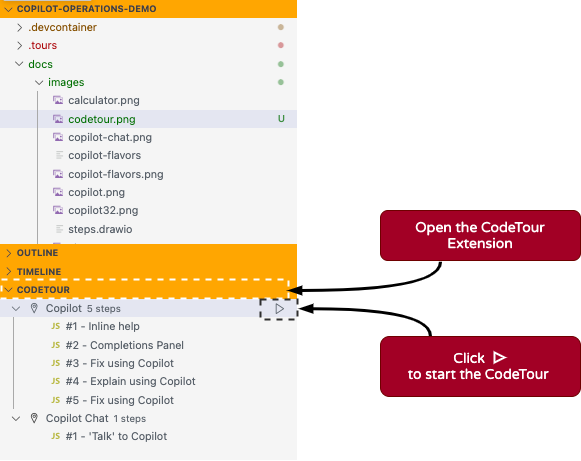

 


# Copilot Operations Demo

A demonstration for utilizing GitHub Copilot within Visual Studio Code. This demo serves as a ***'train the trainer'*** guide, highlighting essential features of the Copilot extension for the benefit of class attendees.
We employ the [CodeTour](https://marketplace.visualstudio.com/items?itemName=vsls-contrib.codetour) extension to guide you through an example of a React Calculator App. 

## Prerequisites & Options

Here are some options and requirements on how to run this demo.

### Option 1: Use [GitHub Codespaces](https://github.com/features/codespaces) and VS-Code

We recommend to run this via [GitHub Codespaces](https://github.com/features/codespaces). We provide a [Devcontainer](https://code.visualstudio.com/docs/devcontainers/containers) configuration that provides all the required IDE components (VS Code).

### Option 2: What if I don't use [GitHub Codespaces](https://github.com/features/codespaces) ?

If you don't want to use Codespaces, just clone this Repo and use a local [Devcontainer](https://code.visualstudio.com/docs/devcontainers/containers) in your VS-Code IDE.

### Option 3: What if I don't use [Devcontainers](https://code.visualstudio.com/docs/devcontainers/containers) ?

If you want to run this Demo on your local platform (no Codespaces, no Devcontainers), please have look at the required tools.

**Here are some requirements you'll need:**
- NodeJS: v19.7.0
- NPM: v9.5.0
- VSCode Extensions:
  - [Copilot](https://marketplace.visualstudio.com/items?itemName=GitHub.copilot)
  - [Copilot Chat](https://marketplace.visualstudio.com/items?itemName=GitHub.copilot-chat)
  - [CodeTour](https://marketplace.visualstudio.com/items?itemName=vsls-contrib.codetour)

---

## Introduction

### Overview

Our goal is to **acquaint you with Copilot's functionalities within VS Code** and demonstrate diverse ways to interact effectively with Copilot.

Copilot and Copilot Chat, while built on the same backend technology, serve distinct roles within your integrated development environment (IDE). To put it simply, **Copilot functions as a coding assistant**, responding to your in-code context, while **Copilot Chat operates as your research assistant**, enabling chat-based communication for more interactive collaboration with Copilot.

As this exercise leverages Copilot for code suggestions, please note that Copilot's responses may vary depending on the context. We welcome this variability, as it showcases the dynamic capabilities of Copilot.

For effective interaction with Copilot, it's essential to keep in mind that **Copilot benefits from your guidance and supervision!**
 
 To use copilot's own words,

 
***"I’m powered by AI, so surprises and mistakes are possible. Make sure to verify any generated code or suggestions, and share feedback so that we can learn and improve."***

---

## Before you Start the Tour

We provide you with several **Code Tour** exercises, to practice Copilot interactions. The first step is to setup/start the `calculator` app.

---

### Start the `Calculator` App

```bash
npm install
npm start
```

- Open a browser window (http://localhost:3000)
> **Note:** this shows the finished version of the calculator App, at the start of the CodeTour your browser should not show the calculator, yet, adding this is part of the Demo.

 

---

### Start the tour ...

Here is a screenshot of what the CodeTour extension looks like in the IDE (VS-Code).



---

### Note: These are exercise items that should be addressed in the Demo

|Copilot|Copilot Chat|
|---|---|
|Inline help|Say Hello|
|Open the Completions Panel|Check its limits|
|Fix using Copilot|Test its knowledge|
|Explain using Copilot|Topics ‘/’|


