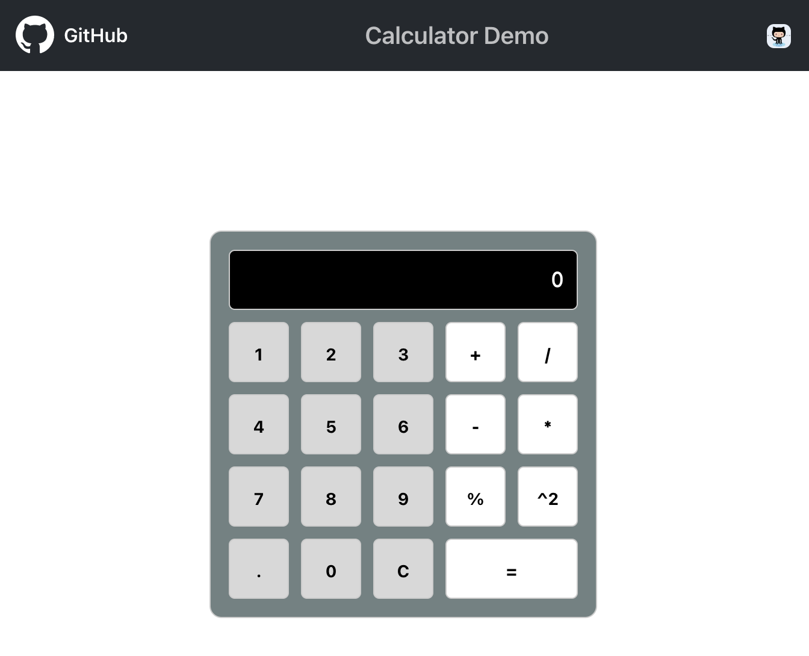

# Copilot Operations Demo
A demo to operate GitHub Copilot in Visual Studio Code

We use a React Calculator App to Demonstrate Copilot & Copilot Chat

## Introduction

### Overview

Our goal is to **acquaint you with Copilot's functionalities within VS Code** and demonstrate diverse ways to interact effectively with Copilot.

Copilot and Copilot Chat, while built on the same backend technology, serve distinct roles within your integrated development environment (IDE). To put it simply, **Copilot functions as a coding assistant**, responding to your in-code context, while **Copilot Chat operates as your research assistant**, enabling chat-based communication for more interactive collaboration with Copilot.

As this exercise leverages Copilot for code suggestions, please note that Copilot's responses may vary depending on the context. We welcome this variability, as it showcases the dynamic capabilities of Copilot.

For effective interaction with Copilot, it's essential to keep in mind that **Copilot benefits from your guidance and supervision!**
 
 To use copilot's own words,

 
***"I’m powered by AI, so surprises and mistakes are possible. Make sure to verify any generated code or suggestions, and share feedback so that we can learn and improve."***

---

## Start the Tour

We provide you with several **Code Tour** exercises, to practice Copilot interactions.

> **Note:** This is an IDE based demo, we recommend to run this via [GitHub Codespaces](https://github.com/features/codespaces). We provide a Devcontainer configuration that provides all the required IDE components (VS Code).
> If you do not have [GitHub Codespaces](https://github.com/features/codespaces), just clone this Repo and use a local *devcontainer* in you VS-Code IDE.

---

### 1. Step

- Start the `Calculator` App

    ```bash
    npm install
    npm start
    ```

- Open a browser window (http://localhost:3000)
    > (Command VS Browser: Start Browser)


    

---

### 2. Step

- Start the tour ...

---

### Note: Exercise items

|Copilot|Copilot Chat|
|---|---|
|Inline help|Say Hello|
|Open the Completions Panel|Check its limits|
|Fix using Copilot|Test its knowledge|
|Explain using Copilot|Topics ‘/’|


